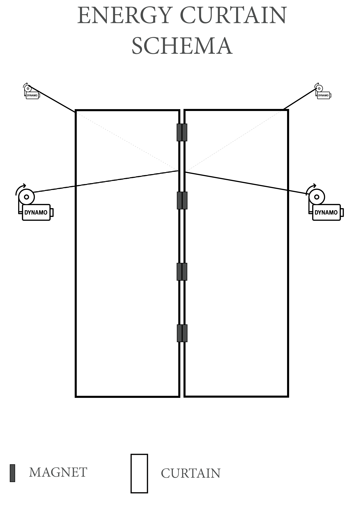

# 🧩 Energy Curtain — Passable energy-harvesting partition

## 🌿 General description
**Energy Curtain** is an innovative device blending education, eco-design and simple technology:  
👉 A semi-transparent flexible partition (e.g. mosquito-net fabric) with magnetic closures at the center that automatically reclose after passage.

👉 When a pedestrian or animal passes through the curtain:
- It pushes it aside → generates a slight traction → this force is transmitted to 4 mini-dynamos (2 front, 2 back, attached to left and right sides).

Objective: **symbolically illustrate the conversion of an ordinary gesture (crossing) into mechanical then electrical energy.**

---

## 🔧 Simplified operation
1️⃣ **Self-closing magnetic center seam**.  
2️⃣ Smooth mechanical transmission via flexible cords → miniature dynamos.  
3️⃣ Micro-energy generation: in the order of milliwatts/day, ideal for education / interactive art.

---

## 🎯 Potential applications
- **High-traffic public spaces** (lobbies, festivals, pedestrian corridors).  
- **Ecological corridors**: passive monitoring of animal crossings.  
- **Educational / artistic installations**: raising awareness of energy production.

---

## 🔔 Known limitations
⚠️ Purely symbolic micro-energy production: no real energetic utility.  
⚠️ Required materials: robust, flexible, safe, outdoor-resistant.

---

## 📜 License & governance
This project is under a **dual license model:**

- **Non-commercial open license:**
  - CERN-OHL-S v2.0 for schematics and hardware.
  - CC-BY-NC-SA 4.0 for documentation/images.
  - See `governance/DUAL_LICENSE.md`.

- **Optional commercial license:**
  - Commercial exploitation: €4,000/year (indexed on 1.5 oz gold).
  - Example: `governance/COMMERCIAL_LICENSE_EN.md`.
  - Purchase: [LemonSqueezy](https://scgfamp.lemonsqueezy.com/buy/8430de49-9b31-4802-a4e6-0b24f7f69aad).

- Full legal notices:
  - `governance/LEGAL_NOTICE.md` & `governance/LEGAL_POSITION.md`:
    - Author retains all commercial rights,
    - GitHub publication = proof of prior art.

---

Author: **Fabien Buisson — Sole Proprietor (SIREN 988 516 506)**  
📧 Contact: [scgfamp@hotmail.com](mailto:scgfamp@hotmail.com)

---

# 🧩 Energy Curtain — Paroi franchissable à récupérateur d’énergie

## 🌿 Description générale
**Energy Curtain** est un dispositif innovant mêlant pédagogie, écoconception et technologie simple :  
👉 Une paroi souple semi-transparente (ex : tissu moustiquaire) avec fermetures magnétiques au centre qui se referment automatiquement après passage.

👉 Lorsqu’un piéton ou animal franchit la paroi :
- Il l’écarte légèrement → provoque une traction → cette force est transmise à 4 mini-dynamos (2 devant, 2 derrière, accrochées aux parois gauche et droite).

Objectif : **illustrer symboliquement la conversion d’un geste ordinaire (passage) en énergie mécanique puis électrique.**

---

## 🔧 Fonctionnement simplifié
1️⃣ **Fermeture auto-réparatrice magnétique** au centre.  
2️⃣ Transmission mécanique douce via fils flexibles → dynamos miniatures.  
3️⃣ Génération de micro-énergie : de l’ordre du milliwatt/jour, idéal pour pédagogie / art interactif.

---

## 🎯 Applications potentielles
- **Espaces publics très fréquentés** (halls, festivals, passages piétons).  
- **Corridors écologiques** : comptage passif des passages animaux.  
- **Installations pédagogiques / artistiques** : sensibilisation à la production énergétique.

---

## 🔔 Limitations connues
⚠️ Micro-production symbolique uniquement : pas d’intérêt énergétique réel.  
⚠️ Matériaux nécessaires : robustes, souples, non blessants, résistants en extérieur.

---

## 📜 Licence & gouvernance
Ce projet est sous **double licence :**

- **Licence libre non-commerciale :**
  - CERN-OHL-S v2.0 pour les schémas et matériels.
  - CC-BY-NC-SA 4.0 pour documentation / images.
  - Voir `governance/DUAL_LICENSE.md`.

- **Licence commerciale optionnelle :**
  - Exploitation commerciale : 4 000 €/an (indexée sur 1,5 oz d’or).
  - Exemple : `governance/COMMERCIAL_LICENSE_EN.md`.
  - Acquisition : [LemonSqueezy](https://scgfamp.lemonsqueezy.com/buy/8430de49-9b31-4802-a4e6-0b24f7f69aad).

- Mentions légales complètes :
  - `governance/LEGAL_NOTICE.md` & `governance/LEGAL_POSITION.md` :
    - L’auteur conserve tous droits commerciaux,
    - Dépôt GitHub = preuve d’antériorité.

---

Auteur : **Fabien Buisson — Entrepreneur Individuel (SIREN 988 516 506)**  
📧 Contact : [scgfamp@hotmail.com](mailto:scgfamp@hotmail.com)
